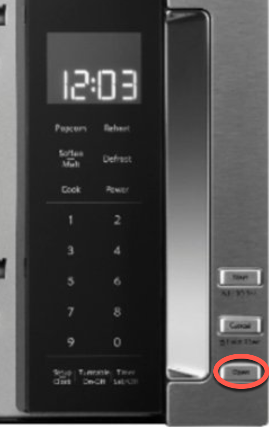
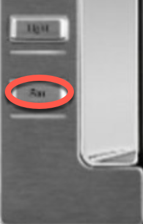
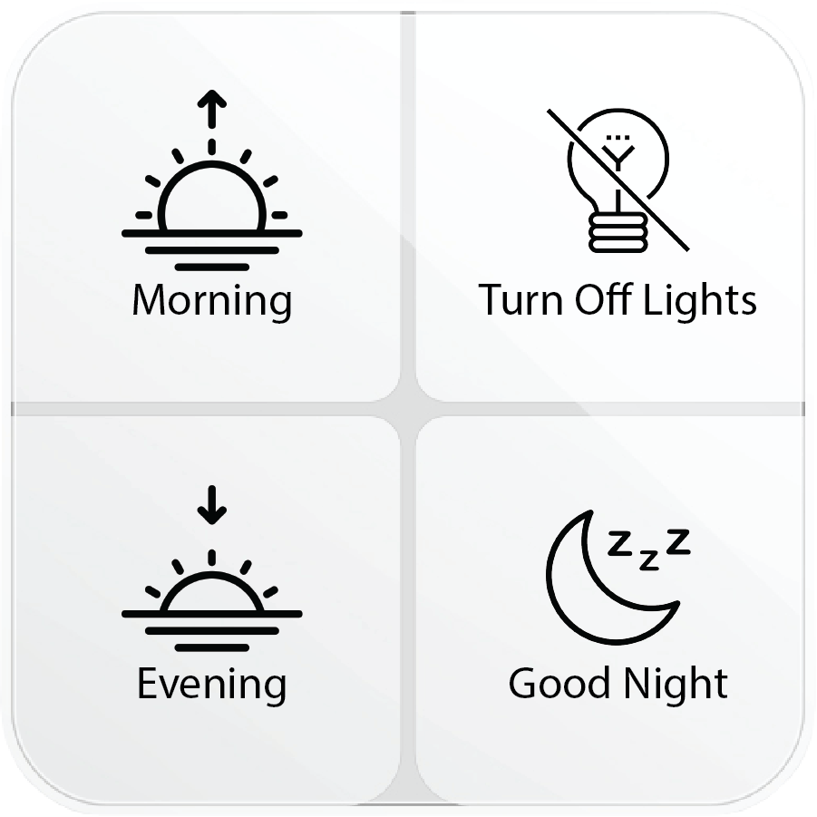
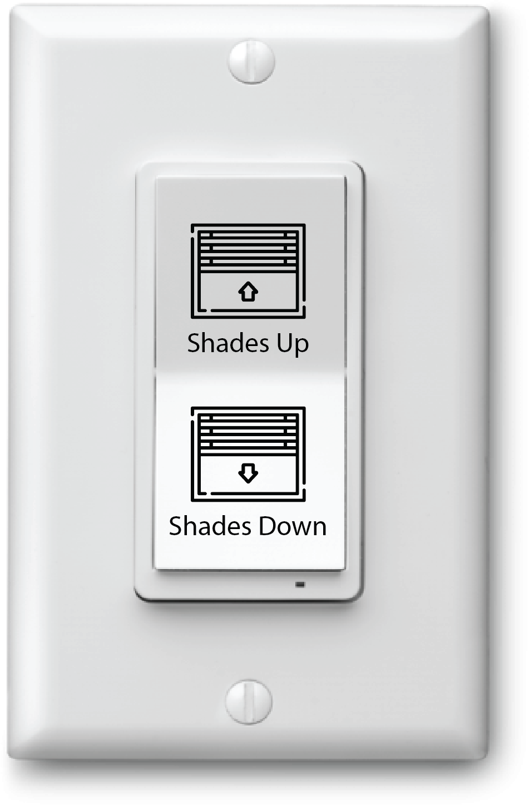

# House Technology

### Microwave:

1. **Start:** Press the 'Open' button on the lower right, accessing the keypad.
2. **Time Setting:** Enter your desired cooking length.
3. **Begin Cooking:** Shut the door and press 'Start.'

### Gas Range, Ventilation Hood:

- **Fan Operation:** The microwave unit also serves as a ventilation system for the stove. To activate, press 'Fan.' Notably, this vents back into the home, not outdoors.

**Caution:** When using the stove, avoid high-heat cooking to prevent smoke, as the ventilation only circulates air into the house.

### Smart Home Light Control

1. **Locate the Controller:** Identify the square control panel situated prominently in each room. You'll recognize it by its sleek design and intuitive layout.
2. **Select Your Scene:** Each controller is programmed with a variety of 'scenes.' These preset options adjust the lights and shades to create specific moods or functional settings. Simply press the button corresponding to the ambiance you desire, such as 'Morning,' 'Evening,' 'Lights Out' or 'Good Night.'
3. **Enjoy the Atmosphere:** The system takes care of the rest, dimming lights or adjusting shades as needed for your chosen scene. The changes are automatic and instantaneous, allowing you to settle into the comfort and mood you've selected without distraction.

### Motorized Shade Controls

1. **Locate the Switch:** Positioned conveniently in each room.
2. **Single Press Operation:** Tap once to command 'Up' or 'Down.'
3. **Brief Delay:** Shades initiate movement within 5 seconds - no repeated pressing necessary.

